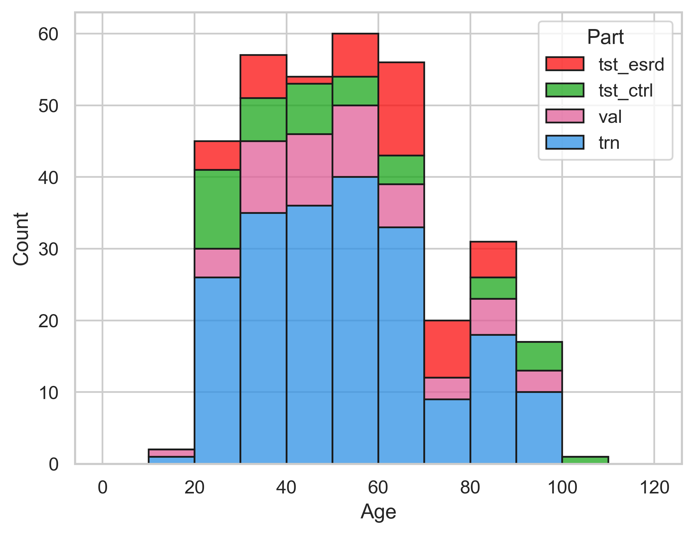

# Small Immuno Age (SImAge)

[](https://pytorch.org/get-started/locally/)
[](https://pytorchlightning.ai/)
[](https://hydra.cc/)
[](https://github.com/ashleve/lightning-hydra-template#license)

Repository with source code for paper "Deep Learning and Gradient Boosting for small immunological clocks" by 
[A. Kalyakulina](https://orcid.org/0000-0001-9277-502X),
[I. Yusipov](http://orcid.org/0000-0002-0540-9281),
[E. Kondakova](http://orcid.org/0000-0002-6123-8181),
[M.G. Bacalini](http://orcid.org/0000-0003-1618-2673),
[C. Franceschi](http://orcid.org/0000-0001-9841-6386),
[M. Vedunova](http://orcid.org/0000-0001-9759-6477),
[M. Ivanchenko](http://orcid.org/0000-0002-1903-7423).

## Description 

Данный репозиторий содержит коды для построения и анализа различных моделей машинного обучения, используемых для решения задачи регрессии хронологического возраста по табличным  данным иммунологического профиля.

### Основные возможности:
- Построение различных моделей машинного обучения для табличных данных (Linear, GBDT, and DNN).
- Hyperparameter search для моделей машинного обучения.
- Интерпретируемости и применение методов объяснимого искусственного интеллекта (XAI).

### Main Technologies

- [PyTorch Lightning](https://github.com/PyTorchLightning/pytorch-lightning) - a lightweight PyTorch wrapper for high-performance AI research.
- [Hydra](https://github.com/facebookresearch/hydra) - a framework for elegantly configuring complex applications. The key feature is the ability to dynamically create a hierarchical configuration by composition and override it through config files and the command line.

## Project Structure

The directory structure is following:

```
├── configs                <- Hydra configuration files
│   ├── callbacks             <- Callbacks configs
│   ├── datamodule            <- Datamodule configs
│   ├── experiment            <- Experiment configs
│   ├── hparams_search        <- Hyperparameter search configs
│   ├── hydra                 <- Hydra configs
│   ├── logger                <- Logger configs
│   ├── model                 <- Model configs
│   ├── trainer               <- Trainer configs
│   └── main.yaml             <- Main configs
│
├── data                   <- Immunological data and generated results
│
├── src                    <- Source code
│   ├── datamodules           <- Datamodules
│   ├── models                <- Models
│   └── utils                 <- Utility scripts
│
├── requirements.txt       <- File for installing python dependencies
├── run.py                 <- Main run file
└── README.md
```

## Install dependencies

```bash
# clone project
git clone https://github.com/GillianGrayson/SImAge
cd SImAge

# [OPTIONAL] create conda environment
conda create -n env_name python=3.9
conda activate env_name

# install pytorch according to instructions
# https://pytorch.org/get-started/

# install requirements
pip install -r requirements.txt
```

## Data description
Данные иммунологического профиля представляют из себя значения концентраций 46 цитокинов в плазме крови для 260 человек.
В контексте этих данных решается задача регрессии хронологического возраста.

### Файловая структура:
```
└── data                    <- Эксперимент по регрессии возраста
   ├── models                 <- Результаты экспериментов для разных моделей
   ├── data.xlsx              <- Dataframe with immunological data
   ├── feats_con_46.xlsx      <- File with all 46 biomarkers
   └── feats_con_10.xlsx      <- File with the most important 10 biomarkers
```
- `data.xlsx` is a dataframe, each row corresponds to sample, each column corresponds to feature. 
In addition to immunological features there are also `Age` (in years).

- `feats_con_*.xlsx` are dataframes which contains features (immunological biomarkers), which will be used as input features of models.

- `models` - это директория, в которой будут сохраняться результаты разных моделей (logs, figures, tables).


## Configuring experiments

### Main config

Location: [configs/main.yaml](configs/main.yaml) <br>
Main project config contains default training configuration.<br>
It determines how config is composed when simply executing command `python main.py`.<br>

<details>
<summary><b>Main project config details</b></summary>

```yaml
# order of defaults determines the order in which configs override each other
defaults:
  - _self_
  - experiment: train     # Global parameters of experiment
  - datamodule: tabular   # Information about dataset 
  - trainer: gpu          # Run configuration for DNN models
  - callbacks: default    # Callbacks for DNN models
  - logger: none          # Loggers for DNN models
  - hydra: default.yaml   # Output paths for logs
  - model: danet          # Model
  - hparams_search: null  # Model-specific hyperparameters

  # enable color logging
  - override hydra/hydra_logging: colorlog
  - override hydra/job_logging: colorlog

```
</details>

### Experiment config

Location: [configs/experiment](configs/experiment)<br>
Experiment config contains global parameters.<br>
Executing command: `python main.py experiment=train`.<br>

<details>
<summary><b>Experiment config details</b></summary>

```yaml
# @package _global_

# Global params
seed: 1337          # Random seed
task: "regression"  # Task type
target: "Age"       # Target column name

# Cross-validation params
cv_is_split: True   # Perform cross-validation?
cv_n_splits: 5      # Number of splits in cross-validation
cv_n_repeats: 5     # Number of repeats in cross-validation

# Data params
in_dim: 10      # Number of input features
out_dim: 1      # Output dimension
embed_dim: 16   # Default embedding dimension

# Optimization metrics params
optimized_metric: "mean_absolute_error"   # All metrics listed in src.tasks.metrics
optimized_mean: "cv_mean"                 # Optimize mean result across all cross-validation splits? Options: ["", "cv_mean"]
optimized_part: "val"                     # Optimized data partition. Options: ["val", "tst"]
direction: "min"                          # Direction of metrics optimization. Options ["min", "max"]

# Run params
max_epochs: 1000          # Maximum number of epochs
patience: 100             # Number of early stopping epochs
feature_importance: none  # Feature importance method. Options: [none, shap_deep, shap_kernel, shap_tree, native]

# Info params
debug: False                # Is Debug?
print_config: False         # Print config?
print_model: False          # Print model info?
ignore_warnings: True       # Ignore warnings?
test_after_training: True   # Test after training?

# Directories and files params
project_name: ${model.name}
base_dir: "${oc.env:PROJECT_ROOT}/data"
data_dir: "${base_dir}"
work_dir: "${base_dir}/models/${project_name}"

# SHAP values params
is_shap: False                      # Calculate SHAP values?
is_shap_save: False                 # Save SHAP values?
shap_explainer: "Tree"              # Type of explainer. Options: ["Tree", "Kernel", "Deep"]
shap_bkgrd: "tree_path_dependent"   # Type of background data. Options: ["trn", "all", "tree_path_dependent"]

# Plot params
num_top_features: 10  # Number of most important features to plot
num_examples: 10      # Number of samples to plot some SHAP figures
```
</details>

### Datamodule config

Location: [configs/datamodule](configs/datamodule)<br>
Datamodule config contains information about loaded dataset, input and target features.<br>
Executing command: `python main.py datamodule=tabular`.<br>

<details>
<summary><b>Datamodule config details</b></summary>

```yaml
_target_: src.datamodules.tabular.TabularDataModule   # Instantiated object
task: "regression"                                    # Task type. Options: ["classification", "regression"]. Here we solve regression problem
feats_con_fn: "${data_dir}/feats_con_${in_dim}.xlsx"  # File with continuous input features
feats_cat_fn: null                                    # File with categorical input features
feats_cat_encoding: label                             # How to encode categorical features? Options: ["label", "one_hot"]
feats_cat_embed_dim: ${embed_dim}                     # Dimension size for categorical features embedding
target: ${target}                                     # Target predicted feature
target_classes_fn: null                               # File with selected classes (for classification tasks only)
data_fn: "${data_dir}/data.xlsx"                      # File with dataset
data_index: index                                     # Index column in dataset file
data_imputation: fast_knn                             # Imputation method for missing values (see https://github.com/eltonlaw/impyute)
split_by: trn_val                                     # Splitting method. Options: [trn_val, top_feat, explicit_feat]
split_trn_val: [0.80, 0.20]                           # Splitting parts for "trn_val" splitting method
split_top_feat: null                                  # Splitting column for "top_feat" splitting method
split_explicit_feat: Split                            # Splitting column for "explicit_feat" splitting method
batch_size: 512                                       # Batch size (for torch DataLoader)
num_workers: 0                                        # Num workers (for torch DataLoader)
pin_memory: False                                     # Memory pinning (for torch DataLoader)
seed: ${seed}                                         # Random seed
weighted_sampler: True                                # Samplers are wighted? For imbalanced data
```
</details>

### Trainer config

Location: [configs/trainer](configs/trainer)<br>
Trainer config contains information about different aspects of DNN training process.<br>
Данный конфигурационынй файл используется для инициализации [PyTorch Lightning Trainer](https://pytorch-lightning.readthedocs.io/en/stable/common/trainer.html).<br>
Executing command: `python main.py trainer=cpu`.<br>

<details>
<summary><b>Trainer config example</b></summary>

```yaml
# All Trainer parameters available here:
# [https://pytorch-lightning.readthedocs.io/en/stable/common/trainer.html]
_target_: pytorch_lightning.Trainer   # Instantiated object
gpus: 0                               # Number of GPUs to train on
min_epochs: 1                         # Force training for at least these many epochs
max_epochs: ${max_epochs}             # Stop training once this number of epochs is reached
```
</details>

### Callbacks config

Location: [configs/callbacks](configs/callbacks)<br>
Callbacks config contains information about [PyTorch Lightning Callbacks](https://pytorch-lightning.readthedocs.io/en/stable/extensions/callbacks.html) for DNN models.<br>
Executing command: `python main.py callbacks=default`.<br>

<details>
<summary><b>Default Callbacks config</b></summary>

```yaml
# All PyTorch Lightning callback described here:
# [https://pytorch-lightning.readthedocs.io/en/stable/extensions/callbacks.html]
early_stopping:                                         # Early stopping callback
  _target_: pytorch_lightning.callbacks.EarlyStopping   # Instantiated object
  monitor: "val/${optimized_metric}_pl"                 # Name of the logged metric which determines when model is improving
  mode: ${direction}                                    # Can be "max" or "min"
  patience: ${patience}                                 # How many epochs of not improving until training stops
  min_delta: 0                                          # Minimum change in the monitored metric needed to qualify as an improvement

model_checkpoint:                                         # Model checkpoint callback
  _target_: pytorch_lightning.callbacks.ModelCheckpoint   # Instantiated object
  monitor: "val/${optimized_metric}_pl"                   # Name of the logged metric which determines when model is improving
  mode: ${direction}                                      # Can be "max" or "min"
  save_top_k: 1                                           # Save k best models (determined by above metric)
  save_last: False                                        # Additionally always save model from last epoch
  verbose: False                                          # Verbosity level
  dirpath: ""                                             # Directory to save the model file
  filename: "best"                                        # Checkpoint filename
  auto_insert_metric_name: False                          # Checkpoints filenames will contain the metric name?
```
</details>

### Logger config

Location: [configs/logger](configs/logger)<br>
Logger config contains information about [PyTorch Lightning Loggers](https://pytorch-lightning.readthedocs.io/en/stable/extensions/logging.html) for DNN models.<br>
Executing command: `python main.py logger=wandb`.<br>
> **Note**: Using W&B requires you to [setup account](https://www.wandb.com/) first.

<details>
<summary><b>W&B logger config example</b></summary>

```yaml
# All supported PyTorch Lightning loggers available here:
# [https://pytorch-lightning.readthedocs.io/en/stable/extensions/logging.html]
# More details abound W&B logging:
# [https://wandb.ai]
wandb:                                                    # W&B logger
  _target_: pytorch_lightning.loggers.wandb.WandbLogger   # Instantiated object
  project: "SImAge"                                       # The name of the project to which this run will belong
  version: 0                                              # Version of the run
  name: null                                              # Name of the run
  save_dir: "."                                           # Path where data is saved
  offline: False                                          # Set True to store all logs only locally
  log_model: False                                        # Upload model checkpoints?
  prefix: ""                                              # String to put at the beginning of metric keys
  group: ""                                               # Group
  tags: []                                                # Tags
```
</details>


### Hydra config

Location: [configs/hydra](configs/hydra)<br>
Logger config contains information about output paths for logs and results in [Hydra](https://hydra.cc) framework.<br>
Executing command: `python main.py hydra=default`.<br>

<details>
<summary><b>Hydra config details</b></summary>

```yaml
# All details about hydra configuration available here:
# [https://hydra.cc]
run:
    dir: ${work_dir}/runs/${now:%Y-%m-%d_%H-%M-%S}          # Output paths for single run
sweep:
    dir: ${work_dir}/multiruns/${now:%Y-%m-%d_%H-%M-%S}     # Output paths for multiple runs
    subdir: ${hydra.job.num}                                # Subdir for each run
```
</details>


### Model config

Location: [configs/model](configs/model)<br>
Model config contains information about selected machine learning model.<br>
Executing command: `python main.py model=lightgbm`.<br>

This study considers various machine learning models specified for tabular data.

#### Linear models:
- [Elastic Net](https://scikit-learn.org/stable/modules/generated/sklearn.linear_model.ElasticNet.html)

#### Gradient Boosted Decision Trees (GBDT):
- [XGBoost](https://xgboost.readthedocs.io/en/stable/)
- [LightGBM](https://lightgbm.readthedocs.io/en/latest/index.html)
- [CatBoost](https://catboost.ai)

#### Deep Neural Networks (DNN):
- [Multilayer Perceptron (MLP)](https://pytorch-widedeep.readthedocs.io/en/latest/pytorch-widedeep/model_components.html#pytorch_widedeep.models.tabular.mlp.tab_mlp.TabMlp)
- [Neural Additive Model (NAM)](https://github.com/AmrMKayid/nam)
- [Neural Oblivious Decision Ensembles (NODE)](https://github.com/manujosephv/pytorch_tabular/tree/main/pytorch_tabular/models/node)
- [Deep Abstract Network (DANet)](https://arxiv.org/abs/2112.02962)
- [TabNet](https://pytorch-widedeep.readthedocs.io/en/latest/pytorch-widedeep/model_components.html#pytorch_widedeep.models.tabular.tabnet.tab_net.TabNet)
- [AutoInt](https://github.com/manujosephv/pytorch_tabular/tree/main/pytorch_tabular/models/autoint)
- [Self-Attention and Intersample Attention Transformer (SAINT)](https://pytorch-widedeep.readthedocs.io/en/latest/pytorch-widedeep/model_components.html#pytorch_widedeep.models.tabular.transformers.saint.SAINT)
- [Feature Tokenizer and Transformer (FT-Transformer)](https://pytorch-widedeep.readthedocs.io/en/latest/pytorch-widedeep/model_components.html#pytorch_widedeep.models.tabular.transformers.ft_transformer.FTTransformer)


<details>
<summary><b>LightGBM model config example</b></summary>

```yaml
# LightGBM parameters available here:
# [https://lightgbm.readthedocs.io/en/latest/Parameters.html]
name: lightgbm              # Model name
objective: regression       # Machine learning task type
boosting: gbdt              # Boosting type
learning_rate: 0.05         # Learning/shrinkage rate
num_leaves: 31              # Max number of leaves in one tree
device: cpu                 # Device for the tree learning
max_depth: -1               # Limit the max depth for tree model (<= 0 means no limit)
min_data_in_leaf: 10        # Minimal number of data in one leaf
feature_fraction: 0.9       # Randomly selected subset of features on each iteration (tree)
bagging_fraction: 0.9       # Like feature_fraction, but this will randomly select part of data without resampling
bagging_freq: 5             # Frequency for bagging
verbose: -1                 # Controls the level of LightGBM’s verbosity
metric: l1                  # Metric to be evaluated on the evaluation set
max_epochs: ${max_epochs}   # Number of boosting iterations
patience: ${patience}       # Number of boosting iteration without improving
```
</details>

### Hyperparameter search config

Location: [configs/hparams_search](configs/hparams_search)<br>
Hyperparameter search config contains information about the ranges of varying parameters specific to each model.<br>
This configuration directory contains files for all the models mentioned in the previous section.<br>
Executing command: `python main.py model=lightgbm hparams_search=lightgbm`.<br>

The searching process of the parameters' best combination is performed by 
[Optuna Sweeper Hydra plugin](https://hydra.cc/docs/plugins/optuna_sweeper/).

<details>
<summary><b>LightGBM model hyperparameter search config example</b></summary>

```yaml
# @package _global_
defaults:
  - override /hydra/sweeper: optuna

# Choose metric which will be optimized by Optuna
optimized_metric: "mean_absolute_error"
optimized_mean: "cv_mean"

# Here we define Optuna hyperparameter search
# It optimizes for value returned from function with @hydra.main decorator
# Documentation: [https://hydra.cc/docs/plugins/optuna_sweeper/]
hydra:
  sweeper:
    _target_: hydra_plugins.hydra_optuna_sweeper.optuna_sweeper.OptunaSweeper   # Instantiated object
    storage: null         # Storage URL to persist optimization results
    study_name: null      # Name of the study to persist optimization results
    n_jobs: 1             # Number of parallel workers
    direction: minimize   # Objective: 'minimize' or 'maximize'
    n_trials: 200         # Total number of runs that will be executed

    # Choose Optuna hyperparameter sampler
    # Documentation: [https://optuna.readthedocs.io/en/stable/reference/samplers/index.html]
    sampler:
      _target_: optuna.samplers.TPESampler    # Instantiated object
      seed: ${seed}                # Seed for random number generator
      consider_prior: true         # Enhance the stability of Parzen estimator by imposing a Gaussian prior
      prior_weight: 1.0            # The weight of the prior
      consider_magic_clip: true    # Enable a heuristic to limit the smallest variances of Gaussians used in the Parzen estimator
      consider_endpoints: false    # Take endpoints of domains into account when calculating variances of Gaussians in Parzen estimator
      n_startup_trials: 50         # The random sampling is used instead of the TPE algorithm until the given number of trials finish
      n_ei_candidates: 10          # Number of candidate samples used to calculate the expected improvement
      multivariate: false          # Single variate optimization

    # Define range of hyperparameters in LightGBM model
    params:
      model.learning_rate: tag(log, interval(0.00001, 1))   # Learning/shrinkage rate
      model.num_leaves: int(range(10, 100, step=1))         # Max number of leaves in one tree
      model.min_data_in_leaf: int(range(1, 50, step=1))     # Minimal number of data in one leaf
      model.feature_fraction: interval(0.6, 1.0)            # Randomly selected subset of features on each iteration (tree)
      model.bagging_fraction: interval(0.6, 1.0)            # Like feature_fraction, but this will randomly select part of data without resampling
```
</details>


## Running experiments

При необходимости, перед запуском эксперимента можно изменить конфигурационные файлы, описанные в предыдущей секции.

### Single experiment

Run training process of the selected model:

```bash
python run.py model=lightgbm
```

### Hyperparameter Search

Create a sweep over hyperparameters with Optuna:

```bash
# This will run hyperparameter search defined in `configs/hparams_search/lightgbm.yaml`
# Over chosen experiment config for LightGBM model `configs/model/lightgbm.yaml`
python run.py --multirun model=lightgbm hparams_search=lightgbm
```
> **Warning**: Optuna sweeps are not failure-resistant (if one job crashes then the whole sweep crashes).


### Additional examples

<details>
<summary><b>Override any config parameter from command line</b></summary>

```bash
# change the maximum number of epochs
python run.py max_epochs=200
```
</details>

<details>
<summary><b>Поддерживается тренировка нейросетевых моделей как на CPU, так и на GPU</b></summary>

```bash
# train on CPU
python run.py trainer=cpu

# train on GPU
python run.py trainer=gpu
```
</details>


<details>
<summary><b>Train neural network models with any logger available in PyTorch Lightning (e.g. W&B)</b></summary>

```yaml
# set project and entity names in `configs/logger/wandb`
wandb:
  project: "your_project_name"
  entity: "your_wandb_team_name"
```

```bash
# train model with Weights&Biases (link to wandb dashboard should appear in the terminal)
python run.py logger=wandb
```
> **Note**: Using wandb requires you to [setup account](https://www.wandb.com/) first.
</details>


<details>
<summary><b>Create a sweep over hyperparameters</b></summary>

```bash
# this will run 6 experiments one after the other,
# each with different combination of learning rate and min data in leaf in LightGBM model
python run.py --multirun model=lightgbm model.learning_rate=0.1,0.05,0.01 model.min_data_in_leaf=5,10
```
</details>


## Results

Hydra creates new output subdirectory in `data/models` directory for every executed run.

### Results structure:
```
└── data 
   └── models
       ├── elastic_net              <- Elastic Net model results                     
       ├── lightgbm                 <- LightGBM model results     
       │   ├── runs                       <- Single run results
       │   │   ├── YYYY-MM-DD_HH-MM-SS          <- Datetime of the run
       │   │   │   └── *Results*                      <- Generated result files           
       │   │   └── ...
       │   └── multiruns                  <- Multiple run results (hyperparameter search)
       │       ├── YYYY-MM-DD_HH-MM-SS          <-  Datetime of the multirun
       │       │   ├── 1                              <- Multirun job number
       │       │   │   └── *Results*                         <- Generated result files
       │       │   ├── 2                              <- Multirun job number
       │       │   │   └── *Results*                         <- Generated result files
       │       │   └── ...
       │       └── ...
       └── ...
```
This structure can be changed by  modifying paths in [hydra configuration](configs/hydra).

### Generated result files:

По итогам работы генерируются следующие файлы:

- `сv_ids.xlsx`: table showing how the samples are divided into training and validation sets in each cross-validation split.

- `metrics_trn_[suffix].xlsx`: values of different 
[regression metrics](https://torchmetrics.readthedocs.io/en/stable/regression/mean_absolute_error.html) on the training set, 
which corresponds to the best cross-validation split.

- `metrics_val_[suffix].xlsx`: values of different 
[regression metrics](https://torchmetrics.readthedocs.io/en/stable/regression/mean_absolute_error.html) on the validation set, 
which corresponds to the best cross-validation split.

- `metrics_cv.xlsx`: values of different 
[regression metrics](https://torchmetrics.readthedocs.io/en/stable/regression/mean_absolute_error.html)
on the train and validation sets on all cross-validation splits.

- `predictions.xlsx`: results of the best model prediction in cross-validation.

- `feature_importances.xlsx[pdf,png]`: table and figures with feature importances, obtained in the best cross-validation split.<br>
You need to specify parameter `feature_importance` in the `experiment` configuration file.

- `feature_importances_cv.xlsx`: table with feature importances on all cross-validation splits.<br>
You need to specify parameter `feature_importance` in the `experiment` configuration file.

- `hist_[suffix].pdf[png]`: figure with samples distribution into training and validation sets in the best cross-validation split.
  <details>
  <summary>Example</summary>
  
  </details>

- `scatter.pdf[png]`: figure with comparison of ground truth and predicted values.

- `model`: model checkpoint file for the best cross-validation split. Different file extensions are possible, depending on the type of model.

## License

This repository is licensed under the MIT License.
